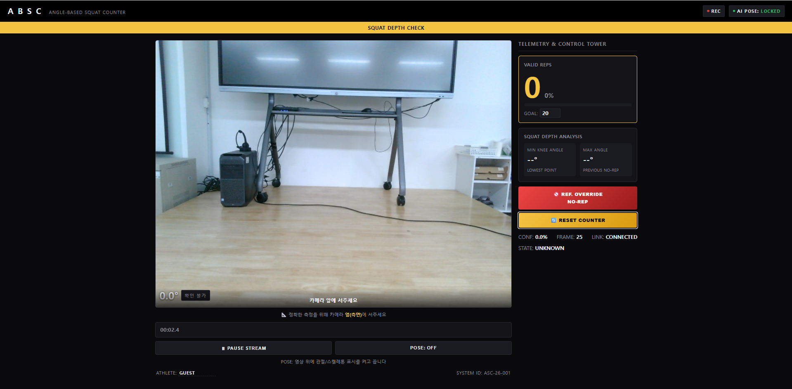
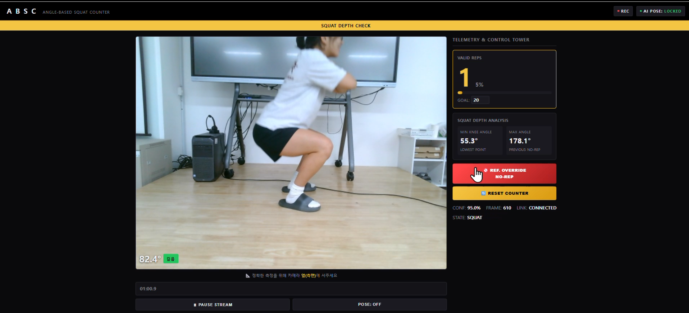
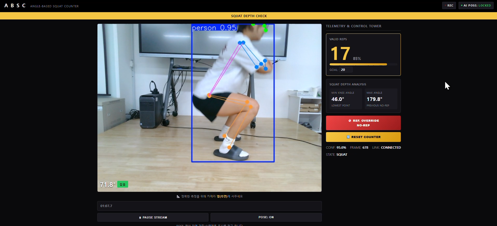
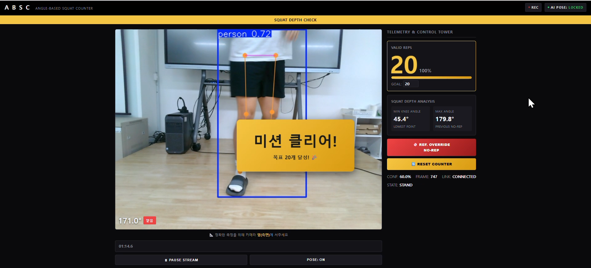

# 📐 Angle-Based Squat Counter

**AI 기반 실시간 스쿼트 깊이 판정 및 반복 횟수 자동 카운팅 시스템**

[](https://www.python.org/)
[](https://flask.palletsprojects.com/)
[](https://github.com/ultralytics/ultralytics)

---

## 📋 목차

- [개요](#개요)
- [스크린샷](#스크린샷)
- [주요 기능](#주요-기능)
- [기술 스택](#기술-스택)
- [설치 방법](#설치-방법)
- [사용 방법](#사용-방법)
- [프로젝트 구조](#프로젝트-구조)
- [테스트 실행](#테스트-실행)

---

## 🎯 개요

**Angle-Based Squat Counter**는 웹캠을 통해 사용자의 스쿼트 자세를 실시간으로 분석하는 프로젝트입니다.
YOLOv8 Pose로 뽑은 hip-knee-ankle keypoint로 무릎 각도를 계산해, 일정 각도 이하로 앉았다가 다시
일어나면 1회로 자동 카운트합니다. 정확한 측정을 위해 카메라를 **측면(옆)**에 두고 사용하는 것을
권장합니다.

---

## 📸 스크린샷

| 대기 상태 | 스쿼트 감지 |
|:---:|:---:|
|  |  |

| 관절(스켈레톤) 표시 | 목표 달성 |
|:---:|:---:|
|  |  |

---

## ✨ 주요 기능

### 1. 실시간 포즈 감지
- YOLOv8m-pose 모델 사용 (GPU 사용 가능 시 CUDA로 자동 추론)
- 웹캠 입력 처리, 17개 keypoint 추출
- **POSE: ON/OFF** 버튼으로 영상 위 스켈레톤 표시를 켜고 끌 수 있음

### 2. 반복 횟수 카운팅 (무릎 각도 기준)
- 무릎 각도가 **DOWN 기준(120°) 이하로 내려갔다가 UP 기준(130°) 이상으로 다시 올라오면** 1회 카운트
- 판정 칩은 "깊음 / 얕음" 두 가지로 표시 (카운팅 기준과 동일한 값 사용)
- **NO-REP 오버라이드**: 방금 카운트된 반복 1회만 무효 처리 (전체 리셋 아님)
- **목표 횟수(GOAL)** 를 직접 입력해서 바꿀 수 있고, 도달하면 "미션 클리어!" 배너가 2초간 표시

### 3. 상황별 안내 문구
얼굴/관절이 화면에 안 잡히거나 자세가 애매할 때 영상 하단에 안내가 뜹니다.
- 카메라 신호 없음 / 카메라 앞에 서주세요 / 몸 전체(엉덩이~발목)가 보이도록 물러나 주세요
- 너무 얕게 앉았을 때, 다 일어서지 않고 다시 앉았을 때도 순간적으로 안내 문구가 표시됨

### 4. 웹 UI
- 실시간 비디오 스트리밍 (영상 클릭 또는 PAUSE 버튼으로 일시정지/재생, 정지 시 ⏸ 아이콘 표시)
- 최소/최대 무릎 각도, 반복 진행률 막대 등 텔레메트리 패널
- ATHLETE(선수 이름) 직접 입력 가능
- 반응형 레이아웃 (좁은 화면에서 1열로 전환)

---

## 🛠️ 기술 스택

| 항목 | 기술 |
|------|------|
| **언어** | Python 3.10 |
| **웹 프레임워크** | Flask |
| **포즈 감지** | YOLOv8-pose (ultralytics) |
| **컴퓨터 비전** | OpenCV |
| **딥러닝** | PyTorch (CUDA 사용 가능 시 GPU 추론) |
| **프론트엔드** | HTML5 / CSS3 / Vanilla JavaScript |

---

## 📦 설치 방법

### 필수 요구사항
- Python 3.10
- 웹캠 (또는 카메라)
- Windows 10 / macOS / Linux

### 설치 단계

#### 1️⃣ 저장소 복제
```bash
git clone https://github.com/Jenny5789/angle-based-squat-counter.git
cd angle-based-squat-counter
```

#### 2️⃣ 가상환경 생성 (Python 3.10)
```bash
# Windows
py -3.10 -m venv venv
venv\Scripts\activate.bat

# macOS / Linux
python3.10 -m venv venv
source venv/bin/activate
```

#### 3️⃣ 의존성 설치
```bash
pip install --upgrade pip setuptools wheel
pip install -r requirements.txt
```

GPU(CUDA)로 추론하려면 사용 중인 그래픽카드/드라이버에 맞는 PyTorch CUDA 빌드를
[공식 안내](https://pytorch.org/get-started/locally/)에 따라 추가로 설치하세요.

#### 4️⃣ 환경 변수 설정
```bash
# .env 파일 생성
echo SECRET_KEY=your-secret-key > .env
```

#### 5️⃣ 앱 실행
```bash
python app.py
```

브라우저에서 `http://localhost:5000` 열기

---

## 🚀 사용 방법

### 기본 사용법
1. 애플리케이션 실행 (`python app.py`)
2. 웹브라우저에서 `http://localhost:5000` 접속
3. **카메라 옆(측면)에서**, 엉덩이~발목까지 보이게 서서 스쿼트 수행
4. 실시간으로 반복 횟수와 참고 각도/판정 확인, 필요하면 NO-REP으로 오카운트 정정

### API 엔드포인트

#### 비디오 스트리밍
```
GET /video_feed
→ Motion JPEG 스트림
```

#### 실시간 데이터
```bash
GET /api/data

응답:
{
    "status": "ok",
    "knee_angle": 85.5,
    "left_knee": 85.0,
    "right_knee": 86.0,
    "depth_state": "DEEP",
    "confidence": 0.95,
    "rep_count": 3,
    "rep_target": 20,
    "counter_state": "DOWN",
    "frame_count": 512,
    "show_keypoints": true,
    "camera_connected": true,
    "guidance": "",
    "athlete_name": "GUEST"
}
```

#### 반복 카운터 리셋
```bash
POST /api/reset-counter
```

#### NO-REP (방금 카운트된 반복 1회만 무효 처리)
```bash
POST /api/no-rep
```

#### keypoint 스켈레톤 표시 토글
```bash
POST /api/toggle-keypoints
```

#### 목표 반복 횟수 변경
```bash
POST /api/set-goal
Body: { "goal": 20 }
```

#### 선수 이름 변경
```bash
POST /api/set-athlete
Body: { "name": "GUEST" }
```

#### 상태 확인
```bash
GET /api/status

응답:
{
    "status": "ABSC System Running",
    "message": "Pose detection and squat analysis active"
}
```

---

## 📁 프로젝트 구조

```
ANGLE-BASED-SQUAT-COUNTER/
├── src/                          # 소스 코드
│   ├── pose_detector.py          # YOLOv8 포즈 감지
│   ├── squat_analyzer.py         # 무릎 각도 계산
│   └── repetition_counter.py     # 상태 머신 기반 카운터 (유닛 테스트용, app.py 로직과 별개)
│
├── tests/                        # 유닛 테스트
│   ├── test_pose_detector.py
│   ├── test_squat_analyzer.py
│   └── test_repetition_counter.py
│
├── templates/
│   └── index.html                # 웹 UI
│
├── static/
│   ├── css/style.css
│   └── js/script.js
│
├── images/                       # README용 스크린샷
├── docs/                         # 프로젝트 문서
│   ├── SCRUM_PROJECT_PLAN.md
│   └── SPRINT_2_REPORT.md
│
├── venv/                         # 가상환경
├── app.py                        # Flask 메인 앱 (실제 카운팅 로직 포함)
├── requirements.txt              # Python 의존성
├── .env                          # 환경 변수
├── .gitignore
└── README.md                     # 이 파일
```

---

## 🧪 테스트 실행

```bash
# 전체 테스트
pytest tests/ -v

# RepetitionCounter 테스트만
pytest tests/test_repetition_counter.py -v
```

---

## 👤 저자

**EJ** - GitHub: [@Jenny5789](https://github.com/Jenny5789)
